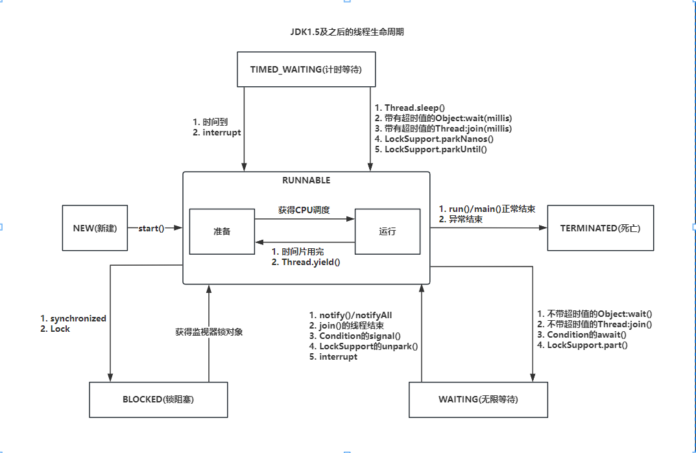
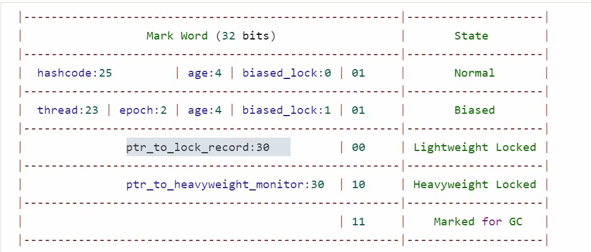
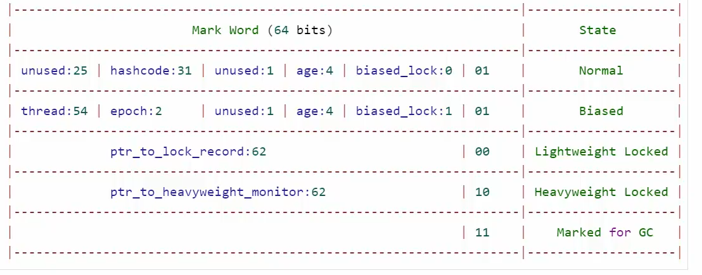

# 多线程

## 程序、进程和线程

* **程序（program）**：为完成特定的任务，用某种语言编写的一组指令的集合。及指**一段静态的代码**
* **进程（process）**：程序的一次执行过程，或是正在内存中运行的应用程序
    * 每个进程都有一个独立的内存空间，系统运行一个程序既是一个进程从创建、运行到消亡的过程（生命周期）
    * 程序时静态的，进程是动态的
    * 进程作为**操作系统调度和分配资源的最小单位**（系统运行程序的基本单位），
    系统在运行时会为每个进程分配不同的内存区域
* **线程（thread）**：进程可进一步细化为线程，是程序内部的一条执行路径，一个进程中至少有一个线程
    * 一个进程同一时间若**并行**执行多个线程，就是支持多线程的。
    * 线程作为**CPU调度和执行的最小单位**
    * 一个进程中多个线程共享相同的内存单元，但多个线程操作共享的系统资源可能就会带来安全隐患
    * JVM就是一个进程，JVM内部的**虚拟机栈**、**本地方法栈**、**程序计数器**每个线程各有一份，
    只有**方法区**和**堆**是线程共享的

### 线程调度

* **分时调度**：所有线程轮流使用CPU的使用权，并且平均分配每个线程占用CPU的时间
* **抢占式调度**：让**优先级高**的线程以较大的概率优先使用CPU。如果线程的优先级相同，
那么会随机选择一个（线程随机性），java使用的为抢占式调度

### 并行与并发

* **并行（parallel）**：指两个或多个事件在**同一时刻**发生（同时发生）。
有多条指令在多个CPU上同时执行。
* **并发（concurrency）**：指两个或多个时间在**同一时间段内**发生。
有多条指令在单个CPU上快速轮换、交替执行，使得在宏观上具有多个进程同时执行的效果

---

## Java内创建和使用线程

* java语言的JVM运行程序运行多个线程，使用`java.lang.Thread`类代表**线程**，
所有线程对象必须是`Thread`类或其子类的实例
* 每个线程都是通过某个特定`Thread`对象的`run()`方法来完成操作的，因此`run()`方法称为线程执行体
* 通过该`Thread`对象的`start()`方法来启动这个线程，而非直接调用`run()`

### 继承Thread类

* 继承`Thread`类并重写`run()`方法，实例化后调用`start()`方法
    * 也可以创建`Thread`类的匿名子类对象使用
* 线程的`start()`方法不能重复调用，否则报错**IllegalThreadStateException**，
必须重新创建线程对象再调用`start()`方法

#### 代码实例

> [详细代码](https://github.com/follow1123/java-basics/blob/main/src/main/java/cn/y/java/multithreading/creation_method/extends_thread/ExtendsThreadTest.java)

* 创建线程

```java
public class PrintNumber extends Thread{

    @Override
    public void run() {
        for (int i = 1; i <= 100; i++) {
            if (i % 2 == 0){
                System.out.println(Thread.currentThread().getName() + ": " + i);
            }
        }
    }
}
```

* 测试

```java
public static void main(String[] args) {
    // 创建对象
    PrintNumber printNumber = new PrintNumber();
    printNumber.start();

    System.out.println(Thread.currentThread().getName() + " main");

    // 创建Thread类的匿名子类对象使用
    new Thread(){
        @Override
        public void run() {
            for (int i = 1; i <= 100; i++) {
                if (i % 2 == 0){
                    System.out.println(Thread.currentThread().getName() + ": " + i);
                }
            }
        }
    }.start();

}
```

### 实现Runnable接口

* 实现`Runnable`接口并实现`run()`方法，在`new Thread()`时传入该对象
    * 也可以创建`Runnalbe`接口的匿名实现类使用

#### 代码示例

> [详细代码](https://github.com/follow1123/java-basics/blob/main/src/main/java/cn/y/java/multithreading/creation_method/impl_runnable/ImplRunnableTest.java)

* 创建线程

```java
public class PrintNumber implements Runnable{

    @Override
    public void run() {
        for (int i = 1; i <= 100; i++) {
            if (i % 2 == 0){
                System.out.println(Thread.currentThread().getName() + ": " + i);
            }
        }
    }
}
```

* 测试

```java
public static void main(String[] args) {

    // 使用实现Runnable接口的类实现
    PrintNumber printNumber = new PrintNumber();

    new Thread(printNumber).start();

    System.out.println(Thread.currentThread().getName() + "main thread");

    // 提供Runnable接口的匿名实现类实现
    new Thread(new Runnable() {
        @Override
        public void run() {
            for (int i = 1; i <= 100; i++) {
                if (i % 2 != 0){
                    System.out.println(Thread.currentThread().getName() + ": " + i);
                }
            }
        }
    }).start();
}
```

### 几种创建线程方式之间的区别

* 继承Thread类和实现Runnable接口的区别
    * 相同点：都是使用`Thread`对象的`start()`方法启动线程，创建的线程对象都是`Thread`类或其子类
    * 不同点：一个是继承类，一个是实现接口
        * 实现`Runnable`接口的好处：避免了java单基础的局限性，更适合处理共享数据问题
    * `Thread`类其实实现了`Runnable`接口，并且`Thread`内部有一个`Runnable`类型的`target`属性，
    当使用继承的方式时，重写从`Runnable`接口内实现的`run()`方法，而当使用实现接口的方式时，
    `Thread`内部的`run()`方法就会调用`target`的`run()`方法，这种方法是代理模式

## Thread类

* 构造器
    * `Thread(String name)`：创建线程并指定线程名
    * `Thread(Runnable target)`：创建线程并目标对象
    * `Thread(Runnable target, String name)`：创建线程并目标对象，并指定线程名
* 常用方法
    * `start()`：启动线程，调用线程的`run()`方法
    * `run()`：线程执行的操作声明处
    * `static currentThread()`：获取当前执行代码对应的线程
    * `getName()`：获取线程名
    * `setName()`：设置线程名
    * `static sleep(long millis)`：使当前线程睡指定毫秒
    * `static yield()`：主动释放CPU的执行权
    * `join()`：在a线程内调用`b.join()`后，a线程会等b线程执行完成后在继续执行，
    如果使用带时间参数的`join(long millis)`则会等待对应的时间
    * `isAlive()`：判断线程是否存活
* 过时方法
    * `stop()`：强行停止线程执行
    * `suspend()`：暂停线程
    * `resume()`：恢复线程
* 线程优先级
    * `getPriority()`：获取线程的优先级
    * `setPriority(int newPriority)`：设置线程的优先级，默认为5，设置范围1~10，
    可以用`Thread`类的三个常量配置
        * `Thread.MIN_PRIORITY`:1 `Thread.NORM_PRIORITY`:5 `Thread.MAX_PRIORITY`:10

### 代码示例

> [详细代码](https://github.com/follow1123/java-basics/blob/main/src/main/java/cn/y/java/multithreading/thread_methods/ThreadMethodsTest.java)

```java
public class ThreadMethodsTest {
    
    @Test
    public void testCurrentThread() {
        // 打印线程名
        System.out.println(Thread.currentThread().getName());

        // 修改线程名
        Thread.currentThread().setName("主线程");

        try {
            // 当前线程休眠1秒
            Thread.sleep(1000);
        } catch (InterruptedException e) {
            throw new RuntimeException(e);
        }

        // 打印线程名
        System.out.println(Thread.currentThread().getName());
    }
    
    
    @Test
    public void testYield() {
        // 子线程打印偶数
        new Thread(new Runnable(){
            @Override
            public void run() {
                for (int i = 1; i <= 100; i++) {
                    if (i % 2 == 0) {
                        System.out.println(Thread.currentThread().getName() + "==" + i);
                    }
                    // 当i为10的倍数是主动释放CPU的执行权
                    if (i % 10 == 0){
                        Thread.yield();
                    }
                }
            }
        }, "sub-thread").start();

        // 主线程打印奇数
        for (int i = 1; i <= 100; i++) {
            if (i % 2 != 0) {
                System.out.println(Thread.currentThread().getName() + "==" + i);
            }
        }
    }

    @Test
    public void testJoin() {
        // 子线程打印偶数
        Thread thread = new Thread(new Runnable() {
            @Override
            public void run() {
                for (int i = 1; i <= 100; i++) {
                    if (i % 2 == 0) {
                        System.out.println(Thread.currentThread().getName() + "==" + i);
                    }
                }
            }
        }, "sub-thread");

        thread.start();

        System.out.println("子线程是否存活：" + thread.isAlive());
        // 主线程打印奇数
        for (int i = 1; i <= 100; i++) {
            if (i % 2 != 0) {
                System.out.println(Thread.currentThread().getName() + "==" + i);
            }
            // 当主线程打印到25时等待子线程完成后在执行
            if (i == 25){
                try {
                    thread.join();
                } catch (InterruptedException e) {
                    throw new RuntimeException(e);
                }
            }
        }
        System.out.println("子线程是否存活：" + thread.isAlive());
    }

    @Test
    public void testPriority() {
        // 子线程打印偶数
        Thread thread = new Thread(new Runnable() {
            @Override
            public void run() {
                for (int i = 1; i <= 100; i++) {
                    if (i % 2 == 0) {
                        System.out.println(Thread.currentThread().getName() + "==" +
                                Thread.currentThread().getPriority() + "==" + i);
                    }
                }
            }
        }, "sub-thread");

        // 设置子线程为最小优先级
        thread.setPriority(Thread.MIN_PRIORITY);
        thread.start();

        // 设置主线程为最大优先级
        Thread.currentThread().setPriority(Thread.MAX_PRIORITY);

        // 主线程打印奇数
        for (int i = 1; i <= 100; i++) {
            if (i % 2 != 0) {
                System.out.println(Thread.currentThread().getName() + "==" +
                        Thread.currentThread().getPriority() + "==" + i);
            }
        }
    }

}
```

## 线程的生命周期

### JDK1.5之前

* 线程的生命周期有5种状态：**新建（New）**、**就绪（Runnable）**、**运行（Running）**、
**阻塞（Blocked）**、**死亡（Dead）**。


### JDK1.5及之后

* 六种状态，在`java.lang.Thread.State`的枚举类中定义
    * **NEW(新建)**：线程刚被创建，还没调用`start()`方法
    * **RUNNABLE(可运行)**：代替就绪和运行状态
    * **TERMINATED(被终止)**：表示此线程已经结束生命周期，终止运行
    * **BLOCKED(锁阻塞)**：一个正在阻塞、等待一个监视器锁的线程的状态
        * A，B两个线程抢同一把锁，A线程抢到那么A线程进入`RUNNABLE`状态，而B线程就进入了`BLOCKED`状态
    * **TIMED_WAITING(计时等待)**：一个正在有限时等待另一个线程执行唤醒动作的线程的状态
        * 当前线程使用`Thread.sleep(milliS)`睡眠时就进入了这个状态
        * 另一个线程在当前线程调用了`join(millis)`方法，当前线程进入了这个状态
        * 当前线程进入同步代码块内，并调用了锁对象的`wait(millis)`方法，就会进入这个状态
    * **WAITING(无限等待)**：一个无限期等待另一个线程执行唤醒动作的线程的状态
        * 另一个线程在当前线程调用了`join()`方法，当前线程进入了这个状态，必须等另一个线程执行完
        * 当前线程进入同步代码块内，并调用了锁对象的`wait()`方法，就会进入这个状态，
        必须调用锁对象的`notify()/notifyAll()`方法唤醒



#### 代码示例

> [详细代码](https://github.com/follow1123/java-basics/blob/main/src/main/java/cn/y/java/multithreading/thread_lifecycle/ThreadLifecycleTest.java)

```java
/**
 * 线程生命周期测试，JDK1.5及之后
 */
public class ThreadLifecycleTest {

    private static void sleep(long millis) {
        try {
            Thread.sleep(millis);
        } catch (InterruptedException e) {
            throw new RuntimeException(e);
        }
    }

    /**
     * 测试线程创建，运行和终止
     */
    @Test
    public void testNewRunnableTerminated() {
        Thread thread = new Thread(new Runnable() {
            @Override
            public void run() {
                System.out.println(Thread.currentThread().getState()); // RUNNABLE
            }
        });
        System.out.println(thread.getState()); // NEW
        thread.start();

        sleep(1000);

        System.out.println(thread.getState()); // TERMINATED
    }

    /**
     * 测试竞争锁等待
     */
    @Test
    public void testBlocked() {
        Object lock = new Object();
        Thread[] threads = new Thread[2];
        Runnable runnable = new Runnable() {
            @Override
            public void run() {
                synchronized (lock) {
                    System.out.println(Thread.currentThread().getName() + " get lock");
                    // 获取锁后打印所有线程的状态
                    System.out.println(threads[0].getName() + "---" + threads[0].getState());
                    System.out.println(threads[1].getName() + "---" + threads[1].getState());
                }
            }
        };

        Thread thread1 = new Thread(runnable);
        Thread thread2 = new Thread(runnable);
        threads[0] = thread1;
        threads[1] = thread2;

        thread1.start();
        thread2.start();

        sleep(1000);
    }

    /**
     * 测试有限期等待
     */
    @Test
    public void testTimedWaiting() {
        // 使用sleep方式
        Thread thread1 = new Thread(new Runnable() {
            @Override
            public void run() {
                sleep(1000);
            }
        });
        // 使用join方式
        Thread thread2 = new Thread(new Runnable() {
            @Override
            public void run() {
                try {
                    thread1.join(500);
                } catch (InterruptedException e) {
                    throw new RuntimeException(e);
                }
            }
        });
        // 使用wait方式
        Object lock = new Object();
        Thread thread3 = new Thread(new Runnable() {
            @Override
            public void run() {
                synchronized (lock){
                    try {
                        lock.wait(800);
                    } catch (InterruptedException e) {
                        throw new RuntimeException(e);
                    }
                }
            }
        });

        thread1.start();
        thread2.start();
        thread3.start();

        sleep(200);
        System.out.println(thread1.getState()); // TIMED_WAITING
        System.out.println(thread2.getState()); // TIMED_WAITING
        System.out.println(thread3.getState()); // TIMED_WAITING
    }

    /**
     * 测试无限期等待
     */
    @Test
    public void testWaiting() {
        // 使用wait方式
        Object lock = new Object();
        Thread thread1 = new Thread(new Runnable() {
            @Override
            public void run() {
                synchronized (lock){
                    try {
                        lock.wait();
                    } catch (InterruptedException e) {
                        throw new RuntimeException(e);
                    }
                }
            }
        });
        // 使用join方式
        Thread thread2 = new Thread(new Runnable() {
            @Override
            public void run() {
                try {
                    thread1.join();
                } catch (InterruptedException e) {
                    throw new RuntimeException(e);
                }
            }
        });

        thread1.start();
        thread2.start();

        sleep(200);
        System.out.println(thread1.getState()); // WAITING
        System.out.println(thread2.getState()); // WAITING

        // 打印后唤醒thread2
        synchronized (lock){
            lock.notify();
        }

    }
}
```

---

## JUC

## 共享模型

### 共享问题

* **临界区**
  一段代码块内会对一个资源进行读写操作，会有多个线程执行这段代码块，这段代码块就叫临界区
* **竞态条件**
  多个线程在临界区内执行，由于代码的执行序列不同而导致结果无法预测，称之为发生了竞态条件

### synchronized

* 锁升级原理





* 无锁到偏向锁
  * 对象的markword倒数第三位为1的话则可以使用偏向锁，否则竞争时直接升级为轻量级锁。
  * 无锁到偏向锁的过程：
    * 一个线程需要加锁时会将线程的id写入锁对象的markword头上面，

### 线程安全分析

### Monitor

使用synchronized(obj) 锁定一个对象时将这个对象和操作系统提供的monitor对象关联，

```mermaid
graph TD

subgraph Monitor
	a(WaitSet)
	b(EntitySet)
	c(Owner)
end
```

一个monitor对象包含这几个属性，

* entitySet
  * 当一个线程获取对象锁时如果owner已经指向一个线程则进入这个队列等待
* Owner
  * 当一个对象获取该对象锁时，如果owner没有指向任何线程，则owner指向这个线程，代表这个对象锁被该线程拥有

当对象锁和monitor关联后，这个对象的markword位置则会存放指向monitor的指针，而markword里面的相关属性会被存放到monitor对象内


### wait/notify
### 现车状态转换

### 活跃性

### Lock


# 其他

## synchronized

###### 保证被包裹的代码块的原子性

* 底层实现（大致）：
  * JDK早期直接就是重量级锁（向操作系统申请锁）
  * 后来改进为锁升级的过程
    * 偏向锁：当一段加锁了的代码第一次被一个线程访问时，会在这个锁上标记这个线程的id号，下次如果还是这个线程访问就直接通行，没有进行其他操作，提高了效率。
    * 自旋锁：接着上面的过程，如果有多个线程访问时，当一个线程持有这个锁未释放时，其他线程就会在外面执行自选操作，类似while循环。
    * 重量级锁：当自旋次数达到10此后就会向操作系统申请重量级锁。
  * 理解：偏向锁和自旋锁都是用户态的操作效率会提高，重量级锁是用户态内核态频繁切换，降低了效率，但是自旋锁也有缺点，就是如果当自旋的线程多了起来也会降低效率，因为自旋操作时这个线程没有被挂起，当自旋的线程多了之后就会有一大堆线程在执行自旋操作，而操作算是一种无意义的操作，所以当一段加锁的代码执行时间很长而且会有很多个线程访问时不建议使用自旋锁
* 在synchronized代码块内出异常默认锁会被释放
* synchronized不能锁字符串常量和基础的数值包装类型
  * 字符串常量在字符串常量池内始终是一个对象
  * 数组包装类型由于内部结构跟改一下就会变成不同的对象

## volatile

###### 保证被修饰的对象不被指令重排

* 保证线程的可见性
  * jvm虚拟机分为heap、stack等空间，heap空间是共享的而开启线程就是创建一个stack，这两个线程在不同的stack里面访问heap里面的同一个数据时都需要copy一份数据到自己stack空间里面的数据存储区域内，再在自己的区域内对这个数据进行修改，修改完才写回到heap空间，而另一个线程也需要获取这个数据，而不知道这个数据被没被修改，所以需要保证线程的可见性这里需要使用到cpu的缓存一直循协议。
* 禁止指令重排
  * 编译器会将程序编译完的指令进行重写排序以提高效率。
  * 我自己的理解：在一段代码内上半部分的代码执行耗时上，下半部分的代码执行耗时端，而这两部分代码执行时也没有太多关联，编译器就会将下半部分的代码编译完的指令安排到上半部分代码前面执行。
  * 在单例模式的双重检测锁实现方式下也需要使用volatile关键字修饰实例对象
    * 因为jvm在创建对象时会分为三步：申请空间、初始化成员变量、赋值到实例，在这几个部分内：
      * 如果第一个线程在锁内初始化这个对象，初始化时发生了指令重排，把第二和第三个步骤换了一下，那么第二个线程就会拿到一个默认值全部为空的对象。

## 两阶段终止模式

```mermaid
graph TD
w("while(true)") --> a
a("是否被打断？") --> b("料理后事")
b --> c((结束循环))
a --> 否 --> d(睡眠2s)
d --> 无异常 --> e(执行监控记录)
d --> 有异常 --> i(设置打断标记)
i --> w
e --> w
```

### 

