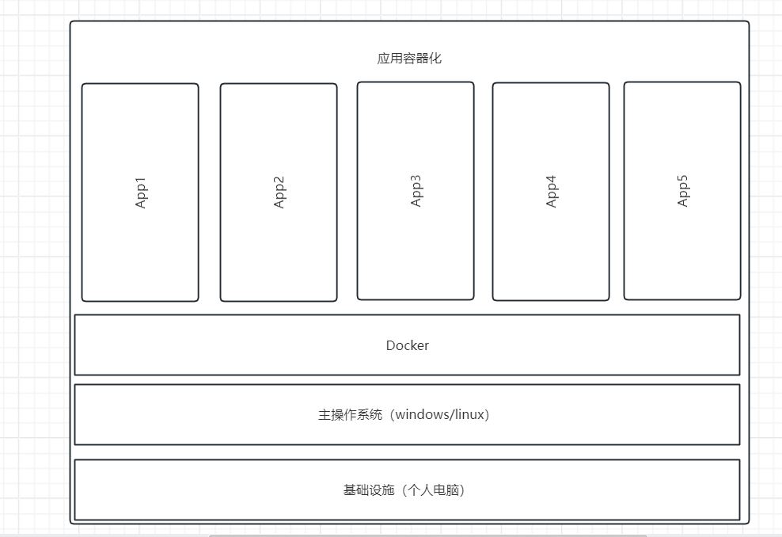

# Docker

* **系统平滑移植**，**容器虚拟化技术**
* docker可以通过镜像（image）将操作系统核心除外，运行程序所需要的系统环境，由下而上打包，达到跨平台无缝接轨运行，代替程序即应用的观念

## 传统虚拟机与容器的对比

### 虚拟机

* 虚拟机架构


* 缺点
    * 资源占用多
    * 冗余步骤多
    * 启动慢

### 容器

* Linux容器（Linux Containers或LXC）
* LInux软驱是云系统其他部分隔离开的一系列进程，从另一个镜像运行，并由该镜像提供支持进程所需的全部文件。
容器提供的镜像包含了应用的所有依赖项，因此在从开发到测试再到生产的整个过程中，它都具有可移植性和一致性。
* Linux容器不是模拟一个完整的操作系统而是堆进程进行隔离。有了容器，
就可以将软件运行所需的所有资源打包到一个隔离的容器中。容器与虚拟机不同，不需要捆绑一整套操作系统,
只需要软件工作所需的库资源和设置。系统因此变得高效轻量并保证部署任何环境中的软件都能始终如一地运行

* 容器化架构



* Docker是在操作系统层面上实现虚拟化，直接复用本地主机操作系统，而传统虚拟机则是在硬件层面实现虚拟化。
与穿透虚拟机相比，Docker优势体现为启动速度快，占用体积小

### 对比

|     | Docker容器    | 虚拟机（VM）    |
|---------------- | --------------- | --------------- |
| 操作系统    | 与宿主机共享OS    | 宿主机上的OS运行虚拟机 |
| 存储大小    | 镜像小，便于存储与传输    | 镜像庞大（vmdk、vdi等） |
| 运行性能 | 几乎无性能损失（根据不同程序，不同运行状态损失不一样） | 操作系统额外的CPU、内存损耗 |
| 移植性 | 轻便、灵活，适应于Linux | 笨重，与虚拟化技术耦合高 |
| 部署速度 | 快速，秒级 | 较慢，10s以上 |


## docker安装

> [官网](https://www.docker.com)</br>
> [官方镜像仓库](https://hub.docker.com/)</br>
> [Docker手册](https://docs.docker.com/manuals/)

* 在Docker手册上查找安装的方式


## docker组成

* 镜像（image）
* 容器（container）
* 仓库（repository）

### 镜像

* docker镜像就是一个只读模板，镜像可以用来创建docker容器，一个镜像可以创建多个容器
* docker的镜像文件类似java的类模板，而docker容器实例类似java中new出来的实例对象

### 容器

* 可以把容器看作是一个简易版的Linux环境（包括root用户权限、进程空间、用户空间和网络空间等）和运行在其中的应用程序

### 仓库

* 集中存放镜像文件的位置，类似Maven存放jar包

## docker工作原理

* docker是一个client-server结构的系统，docker守护进程运行在主机上，
通过socket连接客户端访问，守护进程从客户端接受命令并管理运行在主机上的容器

### docker run 流程

```mermaid
flowchart  TD
a(开始) --> b[docker在本机中寻找该镜像]
b --> c{本机是否有该镜像}
c --没有--> d[在docker hub上找该镜像]
c --有--> e[以该镜像为模板生成容器实例运行]
d --> f{docker hub上能否找到}
f --能--> g[下载该镜像到本地]
g --> h[以该镜像为模板生成容器实例运行]
f --不能--> i[返回失败错误,查不到该镜像]

```

## 添加镜像

* 新建文件`/etc/docker/daemon.json`

```json
{
    "registry-mirrors": [
        "https://registry.docker-cn.com",
        "http://hub-mirror.c.163.com",
        "https://docker.mirrors.ustc.edu.cn",
        "https://cr.console.aliyun.com",
        "https://mirror.ccs.tencentyun.com"
    ]
}
```

* Docker Desktop可以在设置里的Docker Engine选项内添加


## 常用命令

### 帮助启动类

| 命令   | 描述    |
|--------------- | --------------- |
| **systemctl start docker**   | 启动docker   |
| **systemctl stop docker** | 停止docker |
| **systemctl restart docker** | 重启docker |
| **systemctl status docker** | 查看docker状态 |
| **systemctl enable docker** | 开机启动docker |
| **docker info** | 查看docker该药信息 |
| **docker --help** | docker帮助文档 |
| **docker 具体命令 --help** | docker命令帮助文档 |

### 镜像相关

| 命令   | 描述    |
|--------------- | --------------- |
| <a href="#commands-images">docker images</a>   | 列出docker内的镜像   |
| <a href="#commands-search">docker search</a> | 搜索镜像 |
| <a href="#commands-pull">docker pull</a> | 从仓库拉取镜像 |
| **docker system df** | 查看镜像/容器/数据卷所占用空间 |
| <a href="#commands-rmi">docker rmi</a> | 删除镜像 |

<a id="command-volume"></a>
### 容器相关

| 命令   | 描述    |
|--------------- | --------------- |
| <a href="#commands-run">docker run</a>   | 新建+启动容器   |
| <a href="#commands-ps">docker ps</a>   | 列出当前所有正在运行的容器 |
| **docker start** | 启动容器 |
| **docker restart** | 重启容器 |
| **docker stop** | 停止容器 |
| **docker kill** | 强制停止容器 |
| <a href="#commands-rm">docker rm</a>   | 删除已经停止的容器 |
| <a href="#commands-logs">docker logs</a>   | 查看容器日志信息 |
| **docker top** | 查看容器内部运行的进程 |
| **docker inspect** | 查看容器内部细节 |
| <a href="#commands-exec">docker exec</a>   | 进入正在运行的容器以命令行交互 |
| **docker attach** | 进入正在运行的容器以命令行交互，退出时会之间停止容器 |
| <a href="#commands-cp">docker cp</a>   | 将容器内文件复制到主机下 |
| <a href="#commands-export">docker export</a>   | 导出容器 |
| <a href="#commands-import">docker import</a>   | 导入镜像 |
| <a href="#commands-commit">docker commit</a>   | 将容器打包为镜像并提交到本地 |

### 数据卷关

| 命令   | 描述    |
|--------------- | --------------- |
| **docker volume ls**   | 列出数据卷   |
| **docker volume create**   | 新建数据卷   |
| **docker volume inspect**   | 显示数据卷详细信息   |
| **docker volume rm**   | 删除数据卷   |

### 命令详情

<a id="commands-images"></a>
#### docker images

* 列出docker内所有镜像
* 列说明
    * `REPOSITORY`：镜像的仓库源
    * `TAG`：镜像标签版本号
    * `IMAGE ID`：镜像id
    * `CREATED`：镜像创建时间
    * `SIZE`：镜像大小
* 同一个仓库源可以有多个TAG版本，代表这个仓库源的不同版本
* 如果不指定镜像的版本标签，默认使用`镜像名:latest`镜像

```bash
docker images
# 列出本地所有的镜像
docker images -a
# 只显示镜像的id
docker images -q
```

<a id="commands-search"></a>
#### docker search

* 从[官方镜像仓库](https://hub.docker.com/)搜索镜像
* 列说明
    * `NAME`：镜像名称
    * `DESCRIPTION`：镜像说明
    * `STARS`：点赞数
    * `OFFICIAL`：是否官方
    * `AUTOMATED`：是否自动构建

```bash
# 只显示前5条搜索信息
docker search --limit 5 redis
```

<a id="commands-pull"></a>
#### docker pull

* 下载镜像
* 格式：`docker pull 镜像名:[TAG]`

```bash
# 下载最新版
docker pull redis
# 下载指定版本
docker pull redis:6.2
```

<a id="commands-rmi"></a>
#### docker rmi

* 删除镜像
* 格式：`docker rmi 镜像id`

```bash
# 根据镜像id删除镜像id使用docker images查看
docker rmi f7d0a5ed08a2

# 强制删除
docker rmi -f f7d0a5ed08a2

# 删除多个
docker rmi -f redis7.4.0 redis:6.2

# 删除所有镜像
docker rmi -f $(docker images -qa)
```
---

<a id="commands-run"></a>
#### docker run

* 格式：`docker run [OPTIONS] IMAGE [COMMAND] [ARG...]`
* 选项说明
    * `--name='容器名称'`：为容器指定一个名称
    * `-d`：后台运行容器并返回一个容器id，也叫启动守护式容器（后台运行）
    * `-P`：随机端口映射，大写P
    * `-p`：指定端口映射，小写p
    * `-i`：以交互模式运行容器，通常与`-t`同时使用
    * `-t`：为容器重新分配一个伪终端，通常与`-i`同时使用
    * `-v`：指定目录映射
    * `-volumes-from`：继承某个容器的目录映射关系

```bash
# 后台启动容器并指定一个名称（启动守护式容器）
docker run -d --name='debian1' debian

# 后台启动容器并将容器的/usr/share/nginx目录映射到主机的/usr/local/web目录
docker run -d -v /usr/local/web:/usr/share/nginx --name='nginx' nginx

# 后台启动名称为n2的nginx容器，目录关系继承至nginx容器
docker run -d -volumes-from nginx --name n2 nginx

# 启动容器并运行容器内的shell与容器进行交互
docker run -it debian /bin/bash
```
<a id="commands-ps"></a>
#### docker ps

* 选项说明
    * `-a`：列出当前所有正在运行的容器+之前运行过的容器
    * `-l`：显示最近创建的容器
    * `-n`：显示最近n个创建的容器
    * `-q`：只显示容器的编号

```bash
# 查看所有容器
docker ps -a

# 显示前3个创建的容器
docker ps -n 3

# 显示所有容器的编号
docker ps -q

# 查看所以从debian镜像启动的容器 
docker ps -af ancestor=debian -q
```

<a id="commands-rm"></a>
#### docker rm

```bash
# 删除指定容器，如果容器正在运行则无法删除
docker rm f7d0a5ed08a2

# 删除指定容器
docker rm -f f7d0a5ed08a2

# 强制删除所有容器
docker rm -f $(docker ps -a -q)
```
<a id="commands-logs"></a>
#### docker logs

```bash
# 查看指定id容器的日志
docker logs f7d0a5ed08a2

# 查看容器日志最后5行
docker logs -n 5 f7d0a5ed08a2 

# 类似linux的tail -f命令
docker logs -f f7d0a5ed08a2
```
<a id="commands-exec"></a>
#### docker exec

* 和`docker attach`的区别是：`docker exec`进入容器后退出不会关闭容器，而`docker attach`会

```bash
# 以交互式命令行进入容器内部
docker exec -it debian1 /bin/bash
```
<a id="commands-cp"></a>
#### docker cp

```bash
# 将debian容器内/tmp目录下的a.txt文件复制到当前目录下
docker cp debian1:/tmp/a.txt ./a.txt
```
<a id="commands-export"></a>
#### docker export

* 将运行中的容器导出为文件
* 可以保存容器内程序生产的内容

```bash
# 将这个容器导出为debian1.tar文件
docker export debian1 > debian1.tar
```

<a id="commands-import"></a>
#### docker import

* 配合`docker export`使用
* 导入后会生成一个新的镜像

```bash
# 导入镜像，导入的镜像名称custom/debian2版本为1.0
docker import debian1.tar custom/debian2:1.0
```
<a id="commands-commit"></a>
#### docker commit

```bash
# 将之间的镜像新加一个软件后提交到本地 
docker commit -m "add new software" -a "y" debian1 y/deb:1.1
```

## docker镜像

* 镜像是一种轻量级、可执行的独立软件包，包含运行某个软件所需的所有内容，
我们把应用程序和配置依赖打包好形成一个可交付的运行环境（包括代码、运行时需要的库、
环境变量和配置文件等），这个打包好的运行环境就是image镜像文件

* docker镜像是由层级文件系统（UnionFS）组成
* docker最底层是由bootfs+rootfs组成，rootfs就是不同的Linux发行版，这些发行版都是最精简的
* 每一个应用程序镜像都是多个镜像组成，例如nginx是由**底层操作系统**+**nginx软件**组成
* docker镜像层都是只读的，容器层是可写的
    * 启动容器后，由于容器是基于镜像启动的，所有在镜像之上叫容器层
* 新建自己的镜像可以从底层开始构建也可以使用<a href="#commands-commit">docker commit</a>命令基于某个镜像构建

## 本地镜像发布到云端流程

* 和git类似先commit到本地再push到远程

### docker私有库

* 下载私有库服务`docker pull registry`后进行配置

## Docker容器数据卷

* 将docker容器内的数据保存进宿主机的磁盘中
* 运行一个带有容器数据卷功能的容器实例，参考<a href="#commands-run">docker run</a>
* 使用`-v`参数创建的目录映射关系默认是匿名的，使用<a href="#command-volume">数据卷</a>相关命令管理数据卷


## 常见问题

### docker虚悬镜像是什么

* 仓库名和标签都是`<none>`

### docker挂载主机目录访问如果出现cannot open directory .: Permission denied

* 在挂在目录后加`--privileged=true`参数即可


## 网络

* `docker network`

`docker build -t 镜像名称:镜像标签 Dockerfile目录` 制作镜像   

## 其他

###
### docker gitlab备份

* `docker ps`获取 container id
* `docker exec -i -t （这里填container id） /bin/bash`

* `gitlab-rake gitlab:backup:create`
* 输出`Creating backup archive xxx_xxx.tar`备份成功
* 文件在创建容器的命令映射的gitlab数据路径下`data/backups`下

## 参考

* 参考https://blog.csdn.net/weixin_43961117/article/details/126125976教程
